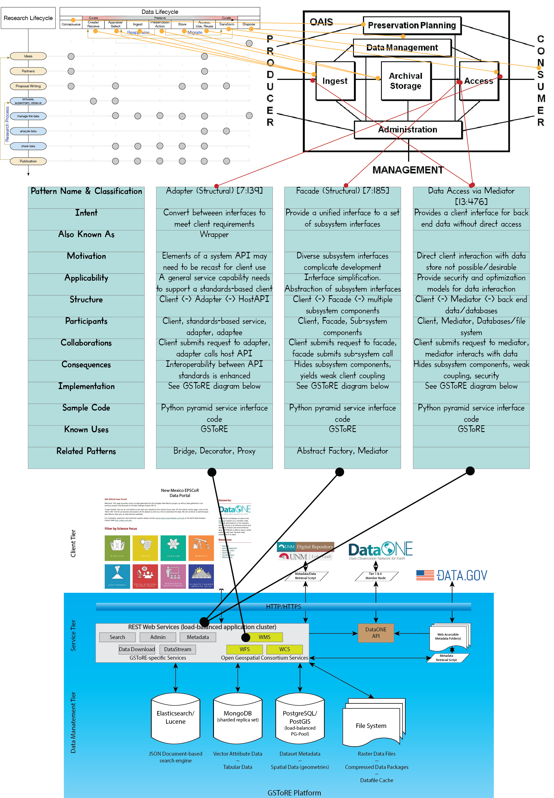

---
title: Distilling Design Patterns From Agile Curation Case Studies (IN41A-1656)

author:
- name: Karl Benedict
  affiliation: University of New Mexico
  affiliation-label: 1
- name: W. Christopher Lenhardt
  affiliation: Renaissance Computing Institute
  affiliation-label: 2
- name: Joshua Young
  affiliation: University Corporation for Atmospheric Research
  affiliation-label: 3

date: December 15, 2016

abstract: In previous work the authors have argued that there is a need to take a new look at the data management lifecycle. Our core argument is that the data management lifecycle needs to be in essence deconstructed and rebuilt. As part of this process we also argue that much can be gained from applying ideas, concepts, and principles from agile software development methods. To be sure we are not arguing for a rote application of these agile software approaches, however, given various trends related to data and technology, it is imperative to update our thinking about how to approach the data management lifecycle, recognize differing project scales, corresponding variations in structure, and alternative models for solving the problems of scientific data curation. In this paper we will describe what we term agile curation design patterns, borrowing the concept of design patterns from the software world and we will present some initial thoughts on agile curation design patterns as informed by a sample of data curation case studies solicited from participants in agile data curation meeting sessions conducted in 2015-16.

conference: American Geophysical Union Annual Meeting. San Francisco, CA. December 12-16, 2016. 

bibliography: ./2016-12_AGUPoster.bib

link-citations: false

target-word-count: 1000
target-figures: 4

...

# Introduction

The challenges that must be addressed by current research data management and curation processes and strategies consist of a combination of established practices that are not compatible with increasing complexity in the data management landscape at the project level; increasing expectations by sponsors, publishers, and institutions relating to data management and curation; and rapid growth in the volume, variety and velocity (three dimensions commonly used to define "big data") of data generated by and used in research. In combination these challenges translate into an increasing need to develop effective data management and curation strategies that align with a set of *shared values and principles* that inform management and curation objectives, and implement processes that are *well documented and portable* across specific data management projects. It is this latter requirement that is addressed in this poster - the development of a framework for capturing elements of successful data curation activities and generalizing those elements into linkages with existing design patterns, or defining new design patterns when they don't exist.
 

## Work to Date

Thus far the focus of the project's work has been on developing a framework within which the team can discuss the concept of *agile data curation* with the community, and iteratively evolving that framework through a series of meeting sessions, workshops and presentations that have been given at multiple venues including AGU (2014, 2015), ESIP Federation Meeting (2016), Research Data Alliance (2014, 2015, 2016), and SciDataCon (2016). In these various activities the team has worked on communicating the conceptual framework for our vision of agile data curation, presented a variety of initial values and principles derived from those defined in the *Manifesto for Agile Software Development* [@beck_manifesto_2001], and solicited the presentation of data management projects that exemplify (either intentionally or unintentionally) these principles. 
 

# Conceptual Model for Agile Data Curation Design Patterns

While this outreach and community engagement work described above is continuing, the work presented here is the starting point for our third goal of adapting the concept of design patterns that had been developed for object oriented software development [@gamma_design_1995], and extended into related domains [@daigneau_service_2011; @lasater_design_2010; @ackerman_patterns-based_2010; @schwinn_design_2005; @hohpe_enterprise_2003], for use in documenting *named* data curation *problems*, *solutions*, and *consequences* that provide *descriptions of generalized data components that are customized to solve a general design problem in a particular context* (adapted from [@gamma_design_1995, section 1.1]). 

The conceptual model that the research team has developed for mapping research data curation functional requirements into design patterns represents a combination of specific research activities that have data-related components (as exemplified in Figure 1) and linkages between those components as envisioned by a model such as the *Open Archival Information System* (OAIS - [@book_reference_2012;@_iso_2012; @oclc_open_2014] - Figure 2). In particular, the research team is currently developing a model for collecting and synthesizing data curation case studies that can be used as exemplars for identifying existing design patterns or developing new ones that are relevant in data curation. 

# Illustration of the Design Pattern Conceptual Model to a Developed Data Management, Discovery and Access Platform - GSToRE

The Geographic Storage, Transformation and Retrieval Engine (GSToRE [@_gstore_2016]) is a data management, discovery and access platform that was developed by the Earth Data Analysis Center as a tiered services oriented architecture (SOA - Figure 3) that was developed to meet the needs of multiple research data discovery, access and interaction models. While the GSToRE platform was not explicitly developed with any specific design patterns, there are a number of design patterns that are roughly represented within its design. The capabilities developed in GSToRE and related research and data managements steps are linked to each other in the diagram provided in Figure 3.   
   

\vfill\columnbreak
 
![Intersection of Research Lifecycle [@_how_2014] and Data Curation Lifecycle Actions [@digital_curation_centre_dcc_dcc_nd] illustrating high-level research activities that involve data-related functions.](Research-DataLifecycleIntegration.png){width=14in}

![OAIS Reference Model [@book_reference_2012;@_iso_2012; @oclc_open_2014] as a high level interaction model between functional components of a preservation system](OAIS_functionalModel.png){width=14in}

# Conclusions

While the research team is in the early stages of the identification of data curation design patterns as part of a larger program of defining an *agile data curation* approach to research data management and preservation, the work presented here represents our first attempt to map an existing data management platform into a set of design patterns that were developed in support of object oriented software development. This mapping provides a frame of reference for engaging with the research data management community in developing a community-based process for documenting design patterns that have proven effective in multiple contexts and implementations.

## Acknowledgements

This work has been partially supported through funding from the National Science Foundation (Award no. IIA-1301346)

\vfill\columnbreak
 
{width=11in}

# Bibliography
&nbsp;
