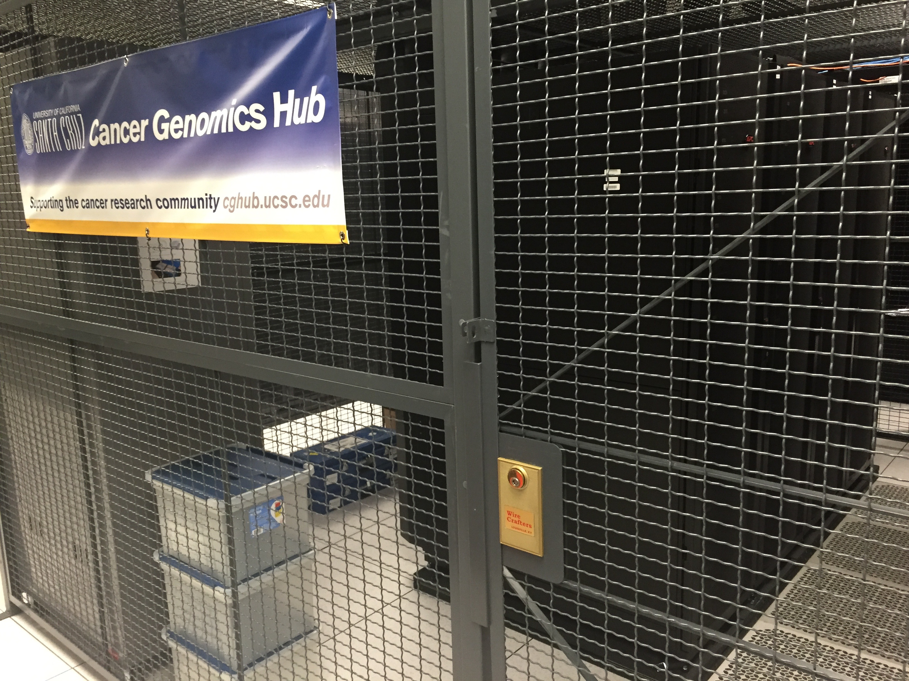
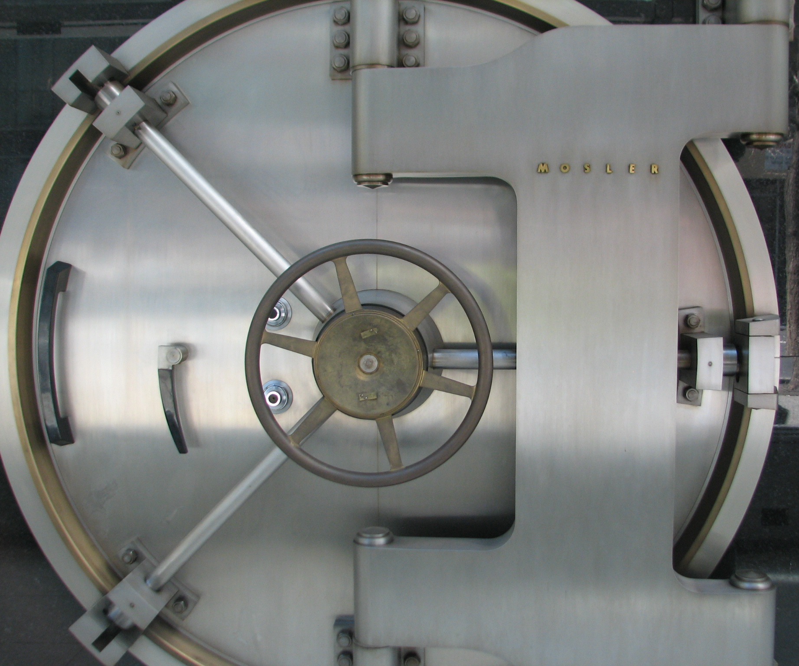

% Data Security 
% Karl Benedict (kbene@unm.edu), Jon Wheeler (jwheel01@unm.edu) - University of New Mexico 
% August 23, 2016

### Overview

* Principles of Data Security
* What Data? (spoiler alert - all of it!)
* Parts of the System
* Tools (some of which you are probably already using)
* Resources

### Principles {.fullBleed .faded}

**Confidentiality** - the information requires protection from unauthorized disclosure.

**Integrity** - The information must be protected from unauthorized, unanticipated, or unintentional modification. 

**Availability** - The information technology resource (system or data) must be available on a timely basis to meet mission requirements or to avoid substantial losses. Availability also includes ensuring that resources are used only for intended purposes. 

-Swanson, M., & National Institute of Standards and Technology (U.S.). (2001). *Security self-assessment guide for information technology systems* (NIST special publication ; Computer security, 800-26; NIST special publication, 800-26; NIST special publication, Computer security.3223114). Gaithersburg, MD: U.S. Dept. of Commerce, Technology Administration, National Institute of Standards and Technology. http://books.google.com/books?id=-AVRAAAAMAAJ

### What Data? {.fullBleed .faded}

Bottom line - you should think about these principles for all of your data. 

The question you must ask:

*What are the consequences of failure?*

### Parts of the System {.fullBleed .faded}

* Storage systems: local, backup, cloud
* Access control (physical and digital)
* Transmission
* *Encryption* 

### Storage {.fullBleed .faded}

* Local options: internal hard drive, external hard drive, local server
* Backup options: local copies moved off site, network copies transfered to remote locations. *Verified*
* Cloud: not generally a primary backup solution - sync capabilities rapidly propagate corruption and deletion
* Dark archival storage: storage of copies of data in a secure system designed to provide for integrity and preservation - but not sharing

### Access Control {.fullBleed .faded}

* Physical Access (physical security controls)
* Electronic Access (network access controls)

### Transmission {.fullBleed .faded}

* Always assume that your network traffic is being monitored/intercepted
* Secure transmission is increasingly important
* Email is a transmission method you must also consider from a security standpoint

### Encryption {.fullBleed .faded}

* Mathematical algorithms used to encode content so that only the keyholder can read it
* Without the key it is computationally difficult to break strong Encryption
* Can be applied to individual files, entire drives, and packets of information transferred over the network

&nbsp;

* Strong Passwords
* Two-factor Authentication - *what you have **and** what you know*
* Access control by user or group (Access Control Lists)

&nbsp;

* **Who has the keys?**

### Tools you Already Use 

* *Windows* and *Mac* Computers have encryption support build into the core operating system
* *Outlook* and *OS X Mail* (and many other email clients) can support sending and receiving encrypted messages
* All of the major cloud data storage providers provide some level of encryption, both at rest and in motion: *DropBox*, *OneDrive for Business*, *Google Drive*, *Amazon S3*, *LoboDrive* (OwnCloud) - **They have the keys** - you have your password
* All browsers support secure transmission using HTTPS, the secure transfer protocol of the web
* There is broad support for secure alternatives for FTP - SFTP, SSH, HTTPS
* Strong passwords can *help* protect your data. There are tools for managing your passwords so you can use strong passwords everywhere

### Resources

* Research Data Services @ UNM - rds@unm.edu / [http://libguides.unm.edu/data](http://libguides.unm.edu/data)
* UNM Information Security & Privacy Office [http://it.unm.edu/security/](http://it.unm.edu/security/)

Swanson, M., & National Institute of Standards and Technology (U.S.). (2001). *Security self-assessment guide for information technology systems* (NIST special publication ; Computer security, 800-26; NIST special publication, 800-26; NIST special publication, Computer security.3223114). Gaithersburg, MD: U.S. Dept. of Commerce, Technology Administration, National Institute of Standards and Technology. http://books.google.com/books?id=-AVRAAAAMAAJ

### &nbsp;

Cloud Provider Security/Encryption information

* Google [https://support.google.com/work/answer/6056693?hl=en](https://support.google.com/work/answer/6056693?hl=en)
* Amazon S3 [http://docs.aws.amazon.com/AmazonS3/latest/dev/serv-side-encryption.html](http://docs.aws.amazon.com/AmazonS3/latest/dev/serv-side-encryption.html)
* Dropbox - [https://www.dropbox.com/security](https://www.dropbox.com/security) 
* OneDrive for Business - [https://technet.microsoft.com/en-us/library/dn905447%28v=office.15%29.aspx](https://technet.microsoft.com/en-us/library/dn905447%28v=office.15%29.aspx)

Operating System Encryption Tools

* Microsoft Windows BitLocker - [https://support.microsoft.com/en-us/instantanswers/e7d75dd2-29c2-16ac-f03d-20cfdf54202f/turn-on-device-encryption](https://support.microsoft.com/en-us/instantanswers/e7d75dd2-29c2-16ac-f03d-20cfdf54202f/turn-on-device-encryption)
* Apple Mac OS X FileVault - [https://support.apple.com/en-us/HT204837](https://support.apple.com/en-us/HT204837)

### &nbsp;

Email Encryption

* GnuPG - [https://www.gnupg.org/](https://www.gnupg.org/)
* PGP - [http://www.pgpi.org/](http://www.pgpi.org/)

Password Managers

* LifeHacker Article with Top 5 Password Managers - [http://lifehacker.com/5529133/five-best-password-managers](http://lifehacker.com/5529133/five-best-password-managers)

### Acknowledgements

Photo Credits

* Skepticalview. *Confidential*. [https://flic.kr/p/9ycMU8](https://flic.kr/p/9ycMU8). [CC-BY-NC-SA 2.0](https://creativecommons.org/licenses/by-nc-nd/2.0/)
* Donna Barber. *Fremantle Bridge Collapse, 22 July 1926*. [https://flic.kr/p/6gSv5p](https://flic.kr/p/6gSv5p). [CC-BY 2.0](https://creativecommons.org/licenses/by/2.0/)
* Gillie Rhodes. *Timing Gears*. [https://flic.kr/p/pCkeoV](https://flic.kr/p/pCkeoV). [CC-BY-NC 2.0](https://creativecommons.org/licenses/by-nc/2.0/)
* Nick Gray. *Storage Lockers*. [https://flic.kr/p/6rwDgC](https://flic.kr/p/6rwDgC). [CC-BY-SA 2.0](https://creativecommons.org/licenses/by-sa/2.0/)
* Karl Benedict. *Secure Data*. [CC-BY 2.0](https://creativecommons.org/licenses/by/2.0/)
* Royce Bair. *Telephone Switchboard Operators - a vintage circa 1914 photo*. [https://flic.kr/p/7kdSbw](https://flic.kr/p/7kdSbw). [CC-BY-NC-ND](https://creativecommons.org/licenses/by-nc-nd/2.0/)
* Roo Reynolds. *Safe*. [https://flic.kr/p/4DLgRb](https://flic.kr/p/4DLgRb). [CC-BY-NC](https://creativecommons.org/licenses/by-nc/2.0/)

